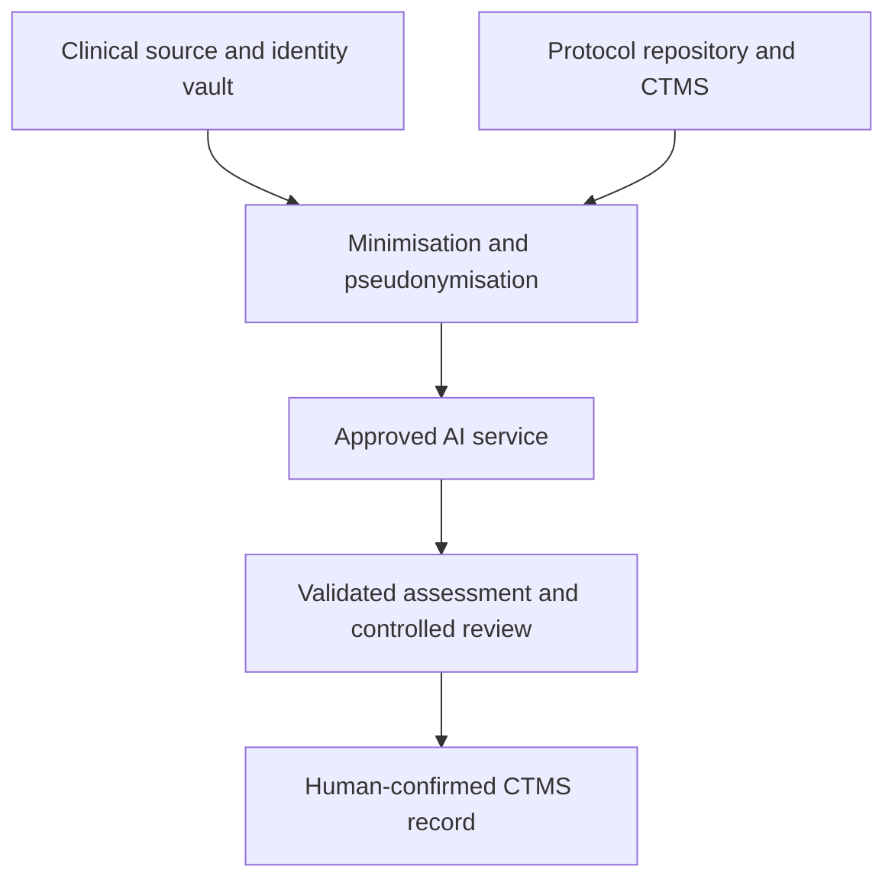

# GDPR Documentation

## Clinical-Trial Eligibility Copilot

**Document status:** Client-facing preliminary GDPR assessment  
**Assessment date:** 3 September 2026  
**Prepared for:** HelixBridge Clinical Research Network GmbH  
**Client status:** Fictional company created for this project  
**System stage:** Synthetic proof of concept / proposed real-data integration  
**Territorial scope:** Initial deployment in Germany, with possible later use in other EU Member States  
**Commercial model:** Consulting-led implementation

> This document is a project-level compliance assessment, not legal advice. The client’s Data Protection Officer (DPO) and qualified legal counsel must confirm the controller roles, lawful bases, national-law conditions, retention periods, vendors, and international-transfer mechanisms before real patient data is processed.

---

## 1. Executive Summary

HelixBridge is assumed to operate four research sites with 12 coordinators, eight actively recruiting trials and approximately 600 patient–trial reviews per month. The proposed pilot is restricted to one moderate-complexity trial, two sites, four coordinators and approximately 150 reviews per month.

The Clinical-Trial Eligibility Copilot supports authorised coordinators by comparing minimum-necessary patient information with individual trial criteria. It produces a proposed criterion-level label (`MET`, `NOT_MET`, `UNKNOWN`, or `NOT_APPLICABLE`), rationale and evidence references. Every result requires coordinator confirmation. Uncertain and otherwise designated high-risk cases receive additional escalation to a senior reviewer or investigator.

Production use would involve health data, which is a special category of personal data under Article 9 GDPR. It also combines sensitive data, vulnerable individuals, data matching and innovative AI-assisted evaluation that can affect whether a person is considered for a clinical-trial opportunity. A full Data Protection Impact Assessment (DPIA) is therefore required before a real-data pilot.

The production design must preserve the following boundaries:

- the AI does not make a final eligibility, exclusion, or enrolment decision;
- no patient is automatically removed, deprioritised, contacted, or enrolled;
- a qualified human reviews every actionable result against authorised source records;
- only minimum-necessary, preferably pseudonymised data is sent to the AI service;
- direct identifiers are kept inside the client-controlled identity boundary;
- model inputs and outputs are not used to train third-party models;
- production vendors require documented approval, processor agreements, security review, and transfer assessment;
- Streamlit, n8n, Notion, and LangSmith are demonstration components and are not approved automatically for identifiable production health data.

The current synthetic MVP processes no real patient data. This document assesses the proposed future integration with EHR or clinical data warehouse systems, protocol repositories, a clinical trial management system (CTMS), a controlled review queue, and an approved AI service.

---

## 2. Scope, Data Subjects, and Data Categories

### 2.1 Data subjects

- patients and potential clinical-trial participants;
- enrolled trial participants where re-screening is explicitly authorised;
- clinical-research coordinators and investigators;
- authorised operational and compliance personnel whose actions appear in audit logs.

### 2.2 Personal-data categories

| Category | Examples | GDPR status | Production treatment |
|---|---|---|---|
| Patient identity | Name, medical-record number, contact details, date of birth | Personal data | Retain inside the client identity boundary; do not send to the model unless strictly required and approved |
| Health and clinical information | Diagnoses, symptoms, medication, laboratory values, procedures, medical history | Special-category data under Article 9 | Minimise, pseudonymise, encrypt, and restrict by role |
| Demographic information | Age, sex, location, relevant protected characteristics | Personal data; may reveal special-category information | Use only where relevant to a criterion; assess bias and necessity |
| Trial-screening information | Trial ID, criterion text, proposed label, rationale, evidence references | Personal data when linked to a patient | Store in the controlled screening or CTMS environment |
| Communications | Contact attempt, appointment, opt-out, patient questions | Personal data | Process only after an authorised human decision and approved contact workflow |
| User and audit data | User ID, role, timestamps, overrides, access history | Personal data | Restrict to security, quality, and accountability purposes |
| Technical data | IP address, device ID, request ID, diagnostic logs | Personal data where identifiable | Minimise and separate from clinical content |

Pseudonymised patient data remains personal data where re-identification is possible using separately held information. Only irreversibly anonymised data falls outside the GDPR.

### 2.3 Data that should not enter the AI request by default

- patient name;
- postal or email address;
- telephone number;
- insurance number;
- national identification number;
- full medical-record number;
- unstructured notes unrelated to the selected criterion;
- images, genomic data, or attachments not required for prescreening;
- information about relatives or other third parties unless strictly necessary;
- staff credentials, API keys, or internal secrets.

---

## 3. Roles and Governance Assumptions

| Party | Preliminary GDPR role | Responsibility requiring confirmation |
|---|---|---|
| HelixBridge Clinical Research Network GmbH | Controller for operating the prescreening service | Determines purpose, patient cohort, data sources, access, retention, and operational use |
| Trial sponsor or CRO | Separate or joint controller depending on actual influence over purpose and means | Must be assessed per protocol and contract; role cannot be assigned by label alone |
| Consulting and integration provider | Processor when acting only on documented HelixBridge instructions; possible separate controller for any independently determined purpose | Article 28 agreement, confidentiality, security, deletion, assistance, subprocessors |
| General-purpose AI/API provider | Processor or subprocessor for production requests if it acts only on instructions | DPA, retention and training settings, hosting, subprocessors, security, transfer mechanism |
| Cloud, integration, monitoring, and queue vendors | Processors or subprocessors | Approval, data-location review, least-privilege access, retention, transfer controls |
| Investigators and coordinators | Authorised persons acting under the controller | Human review, confidentiality, source verification, correction, escalation |

The controller must maintain the record of processing activities, provide transparency information, handle rights requests, approve processors, define retention, ensure security, and complete the DPIA. Processor contracts must meet Article 28 GDPR.

Controller and joint-controller roles must be determined from actual decision-making power. A sponsor/site contract does not override the factual analysis.

---

## 4. Data Flow Map

### 4.1 Detailed flow

1. An authorised query selects a defined patient cohort from the EHR or clinical data warehouse.
2. Trial and criterion information is retrieved from the approved protocol repository or CTMS.
3. The integration layer removes unnecessary fields and replaces direct identifiers with a project-specific pseudonymous ID.
4. Minimum-necessary patient facts and one criterion are sent to the approved AI inference service.
5. The AI returns a proposed label, rationale, evidence references, model identifier, and technical metadata.
6. The application validates the response structure and applies deterministic review-routing rules.
7. The result enters the coordinator’s controlled workflow; uncertain and designated high-risk cases enter an additional escalation queue.
8. A qualified coordinator compares every AI output with the authorised source record, and a senior reviewer or investigator handles escalated cases.
9. Only the human-confirmed outcome may be written to the CTMS or used to initiate an approved patient-contact process.
10. Audit logs record the model version, prompt version, request identifier, routing, reviewer, override, and final action without duplicating unnecessary clinical content.

### 4.2 Trust boundaries

| Boundary | Main control |
|---|---|
| Clinical source systems to integration layer | Service account, documented query, role-based access, purpose limitation |
| Identity data to pseudonymised case | Separate mapping table, restricted re-identification access |
| Client environment to AI provider | Encryption, DPA, approved region, no-training commitment, minimum-necessary payload |
| AI result to coordinator and escalation queue | Schema validation, provenance, model/prompt version, no automatic operational action |
| Review queue to CTMS | Authenticated human confirmation and documented write-back |

---

## 5. Lawfulness and Purpose Limitation

### 5.1 Two-layer legal basis

Processing health data requires both:

1. a lawful basis under Article 6 GDPR; and
2. an applicable exception under Article 9(2) GDPR.

The ethical or clinical informed consent used for trial participation is not automatically the same as GDPR consent. The legal basis must be assessed separately for each processing purpose.

### 5.2 Preliminary lawful-basis options

No single legal basis is fixed by this document. The client must select and document the basis after reviewing its role, trial protocol, Member State law, relationship with the patient, and sponsor arrangements.

| Processing purpose | Possible Article 6 basis | Possible Article 9 condition | Required decision |
|---|---|---|---|
| Search for potentially suitable trial candidates | Article 6(1)(e) public-interest task where grounded in law; Article 6(1)(f) legitimate interests for a private organisation where permitted and balanced; in some cases Article 6(1)(a) consent | Article 9(2)(j) scientific research with Union or Member State law and Article 89 safeguards; Article 9(2)(h) where genuinely part of authorised health care; or Article 9(2)(a) explicit consent | Client counsel and DPO must identify the precise legal and national-law basis before access to EHR data |
| Safety and reliability obligations connected with a clinical trial | Article 6(1)(c) legal obligation where the specific obligation applies | Article 9(2)(i) public interest in public health or another applicable national-law condition | Link the purpose to the exact statutory obligation |
| Human review and contact of a potential participant | Same basis as the authorised recruitment purpose, or a separate basis if the purpose changes | Corresponding Article 9 condition | Define when identity may be revealed and when contact is permitted |
| Security and audit logging | Article 6(1)(c) where legally required and/or Article 6(1)(f) legitimate interests | Logs should avoid clinical data; if health data is unavoidable, the applicable Article 9 condition must continue | Document necessity, restricted access, and retention |
| Model improvement or secondary research | Requires a separate compatibility and lawful-basis assessment | Requires a separate Article 9 condition and Article 89 safeguards | Not authorised by the operational prescreening purpose by default |

Consent should not be selected merely because health data is involved. If consent is used, it must be freely given, specific, informed, unambiguous, demonstrable, and withdrawable without inappropriate disadvantage. The effect of withdrawal on prior lawful processing and trial obligations must be explained.

### 5.3 Purpose limitation

Patient data accessed for prescreening must not be reused automatically for:

- general model training;
- unrelated product development;
- advertising or commercial profiling;
- insurer or employer decisions;
- diagnosis or treatment;
- population research outside the approved protocol;
- creation of a reusable patient-matching database without a separate assessment.

Any secondary use requires a documented compatibility assessment or new lawful basis, appropriate Article 9 condition, transparency update, and DPIA review.

---

## 6. Processing Activities Register

The following table is a project-level input to the Article 30 record. HelixBridge must transfer it into its formal processing-activities register and replace all provisional periods and legal bases with approved decisions.

| Activity | Purpose | Data subjects and data | Preliminary legal basis | Recipients | Proposed retention | Controls |
|---|---|---|---|---|---|---|
| Cohort identification | Identify patients who may warrant human prescreening for an approved trial | Patient ID, minimum relevant demographics and clinical facts | Article 6 basis plus Article 9 condition to be confirmed per site and trial | Authorised site staff; approved hosting/integration processors | Query result should be transient; delete rejected working extracts immediately or within a short approved period | Approved query, purpose binding, minimum fields, access logging |
| Pseudonymisation and case preparation | Prepare a minimum-necessary model input | Pseudonymous case ID, relevant health facts, trial and criterion data | Same basis as cohort identification | Client-controlled eligibility service | Temporary processing only; direct-identifier mapping retained separately under source-system rules | Tokenisation, field allowlist, redaction, separate identity store |
| AI criterion assessment | Generate an assistive label, rationale, and evidence references | Pseudonymous health information, criterion text, model metadata | Same authorised recruitment or research basis; no independent vendor purpose | Approved AI provider and approved subprocessors | No provider training; zero or shortest technically necessary provider retention; client copy per screening schedule | DPA, EU processing where possible, encryption, no direct identifiers, output validation |
| Human review and routing | Enable a qualified person to verify the result | Pseudonymous assessment, relevant source evidence, reviewer identity and decision | Same basis as prescreening; staff-log processing under Article 6(1)(c) or (f) as applicable | Authorised coordinator/investigator; compliance personnel where necessary | Non-match working records: proposed 90 days unless another justified period applies; confirmed records follow CTMS/protocol schedule | RBAC, MFA, source verification, override, no automatic exclusion |
| Identity resolution and patient contact | Allow authorised staff to contact a potentially suitable person | Identity and contact data, trial reference, contact outcome | Separate confirmed recruitment/contact basis plus Article 9 condition | Authorised clinical team; sponsor/CRO only where authorised | Follow approved recruitment and clinical-trial schedule; unsuccessful contacts deleted or minimised when no longer necessary | Human approval, communication script, opt-out/suppression control |
| CTMS write-back | Record the human-confirmed screening outcome | Patient/trial identifier, confirmed outcome, reviewer, date | Applicable trial-management basis | Site network, authorised sponsor/CRO users | Applicable protocol, CTMS, clinical-trial, and legal-retention schedule | Human confirmation, provenance, correction workflow |
| Security and audit logging | Detect misuse, investigate incidents, demonstrate accountability | User ID, timestamp, action, configuration, request ID; minimal clinical content | Article 6(1)(c) and/or 6(1)(f); Article 9 condition if health data appears | Security, DPO, audit and authorised support personnel | Proposed 12–24 months, adjusted to risk and legal requirements | Tamper resistance, restricted access, separation from operational record |
| Performance and bias monitoring | Measure errors, overrides, drift, and subgroup effects | Prefer anonymised or pseudonymised evaluation records | Separate documented compatibility/lawful-basis assessment | Approved quality team and processors | Defined evaluation cycle plus documented deletion date | Data minimisation, aggregation, access restriction, no vendor training |
| Rights and incident handling | Respond to data subjects and security events | Identity, request or incident details, affected records, communications | Article 6(1)(c) legal obligation; relevant Article 9 condition | DPO, legal, security, supervisory authority, affected individuals where required | According to legal-claims, accountability, and incident schedules | Case management, identity verification, access restriction |

### 6.1 Retention principles

- Retention must be defined by purpose and record category, not by a single system-wide period.
- Temporary model payloads should not be retained after inference unless strictly necessary for a documented incident or quality purpose.
- Pre-screening working records are not automatically part of the clinical trial master file.
- If a record becomes an essential clinical-trial record, the applicable Clinical Trials Regulation and national retention rules must be assessed separately.
- Legal-hold requirements override routine deletion only for the records in scope.
- Deletion must propagate to processors, caches, exports, backups according to a documented schedule.

---

## 7. Data Protection Principles and Required Controls

| GDPR principle | Application to the Copilot |
|---|---|
| Lawfulness, fairness, transparency | Document Article 6 and Article 9 grounds; provide Articles 13/14 information; explain AI assistance and human review |
| Purpose limitation | Restrict use to approved trial prescreening; prohibit vendor training and unrelated secondary use |
| Data minimisation | Send only criterion-relevant facts; keep direct identifiers outside the AI payload |
| Accuracy | Display source evidence; allow corrections; record overrides; do not treat the model rationale as fact |
| Storage limitation | Apply purpose-specific retention and automated deletion |
| Integrity and confidentiality | Use encryption, MFA, RBAC, network controls, monitoring, and incident response |
| Accountability | Maintain the DPIA, ROPA, contracts, tests, decisions, logs, training, and approvals |

### 7.1 Security baseline

- encryption in transit and at rest;
- client-managed identity and role-based access;
- multi-factor authentication for privileged and reviewer access;
- least-privilege service accounts;
- project-specific pseudonymous identifiers;
- separate, access-restricted re-identification mapping;
- approved EU/EEA hosting where feasible;
- secrets manager rather than credentials in code or workflow exports;
- allowlisted fields and automated direct-identifier checks;
- no patient data in ordinary application error messages;
- immutable or tamper-evident audit logs;
- vulnerability, patch, dependency, and penetration-testing processes;
- backup, restoration, business-continuity, and secure-deletion tests;
- documented personal-data-breach procedure.

Under Article 33 GDPR, the controller must notify the competent supervisory authority without undue delay and, where feasible, within 72 hours after becoming aware of a reportable personal-data breach. Article 34 notification to affected individuals is required where the breach is likely to result in a high risk, subject to the statutory exceptions.

---

## 8. Short DPIA — Highest-Risk Processing

### 8.1 Processing assessed

The highest-risk operation is the systematic AI-assisted comparison of real patient health information from clinical systems with trial eligibility criteria across a multi-site network.

### 8.2 Why a DPIA is required

The proposed processing combines several recognised high-risk indicators:

- special-category health data;
- potentially large-scale processing across multiple sites;
- evaluation or scoring of individuals;
- matching data from EHR, CTMS, and protocol sources;
- vulnerable data subjects, including ill persons and potentially children;
- innovative AI technology;
- potential effect on access to a clinical-trial opportunity.

Even though the final decision remains with a human, the scale, sensitivity, matching, and potential consequences make a DPIA necessary before production.

### 8.3 Necessity and proportionality

**Business need:** Manual identification and criterion review are time-consuming and may delay recruitment or overlook potential participants.

**Necessity:** The AI should be used only where an approved human-only or deterministic search cannot achieve the purpose with materially lower privacy risk. Each input field must be linked to a criterion or an approved screening rule.

**Proportionality:** The system is proportionate only if it processes a defined cohort, uses minimum data, preserves meaningful human review, prevents automatic exclusion, and limits outputs to the approved recruitment workflow.

### 8.4 Risk assessment

| Risk to individuals | Inherent risk | Main safeguards | Residual risk |
|---|---|---|---|
| Incorrect `MET` output causes an unsuitable patient to be advanced | High | Human source verification, no automatic enrolment, evidence display, validation thresholds, incident review | Medium |
| Incorrect `NOT_MET` or hidden ranking causes a suitable patient to be overlooked | High | No automatic exclusion or suppression, review sampling, override monitoring, recall-focused evaluation | Medium |
| Excessive health information is disclosed to an AI or monitoring vendor | High | Field allowlist, pseudonymisation, direct-identifier redaction, DPA, no-training setting, shortest retention | Medium |
| Unauthorised staff access sensitive screening records | High | RBAC, MFA, site separation, access review, audit alerts | Low–medium |
| Re-identification of pseudonymised cases | High | Separate mapping, restricted re-identification service, encryption, no unnecessary quasi-identifiers | Medium |
| Bias reduces trial access for demographic or clinical subgroups | High | Subgroup evaluation, representative validation data, monitoring, human oversight, documented remediation | Medium |
| Automation bias turns human review into a rubber stamp | High | Training, source-first review, authority to reject, reviewer rationale, override audits, workload controls | Medium |
| Data is retained or reused for model training or unrelated analytics | High | Contractual prohibition, technical settings, purpose binding, retention enforcement, vendor audit rights | Low–medium |
| International access exposes health data to incompatible law or government access | High | EU processing, transfer mapping, adequacy or SCCs, transfer impact assessment, encryption and supplementary measures | Medium |
| Security incident exposes linked clinical and trial information | High | Segmentation, encryption, logging, incident response, testing, minimal central storage | Medium |

### 8.5 Measures required before pilot approval

1. Approve the Article 6 basis, Article 9 condition, and relevant German or other Member State law.
2. Complete controller, joint-controller, processor, and subprocessor role analysis.
3. Approve the production architecture and vendor list.
4. Prevent direct identifiers from entering model and observability payloads by default.
5. Configure no model training and the shortest supported retention.
6. Implement meaningful human review and prohibit automatic exclusion or enrolment.
7. Define accuracy, unsafe-error, review-recall, subgroup, and stop thresholds.
8. Complete security testing and access-control validation.
9. Approve patient transparency information and rights-handling procedures.
10. Complete transfer assessments and contracts.
11. Establish incident, correction, suspension, and rollback procedures.
12. Record DPO advice and the controller’s formal residual-risk decision.

### 8.6 DPIA conclusion

The processing presents a high inherent privacy risk. With the safeguards above, residual risks may be reduced to a controlled but non-trivial level. A real-data pilot must not begin until HelixBridge has completed and approved the full DPIA after consulting its DPO and recording the DPO’s advice.

If high residual risk remains and cannot be mitigated, the controller must consult the competent supervisory authority under Article 36 GDPR before processing begins.

---

## 9. Automated Decision-Making and Human Review

The intended design does not make a solely automated decision with legal or similarly significant effects. Article 22 GDPR is therefore not expected to prohibit the intended workflow, provided human review is genuine rather than ceremonial.

Meaningful review requires that the reviewer:

- sees that the output is AI-generated;
- can inspect the relevant source information;
- understands the label definitions and limitations;
- can change or reject the recommendation;
- has authority and sufficient time to do so;
- records the final decision and material reasons;
- does not receive only candidates pre-filtered through an unreviewed automatic exclusion step.

If the system begins automatically excluding, ranking, suppressing, contacting, or enrolling individuals, an immediate Article 22, DPIA, and EU AI Act reassessment is required.

---

## 10. Data Subject Rights Support

### 10.1 Transparency

Articles 13 and 14 notices should explain in clear language:

- who the controller and DPO are;
- the prescreening purpose;
- categories and sources of patient data;
- Article 6 basis and Article 9 condition;
- use of AI-assisted matching;
- that a human makes the final decision;
- recipients and processor categories;
- international transfers and safeguards;
- retention criteria;
- applicable rights;
- whether data was obtained from another source;
- how to complain to a supervisory authority;
- material consequences of providing or not providing data;
- whether any solely automated decision-making occurs.

Information should be layered: a concise patient-facing explanation linked to a detailed privacy notice.

### 10.2 Operational rights procedure

| Right | Support mechanism |
|---|---|
| Access — Article 15 | Search by verified identity across source, screening, queue, CTMS, and relevant audit systems; provide intelligible copies and processing information |
| Rectification — Article 16 | Correct source data where appropriate, propagate corrections, and mark previous AI assessments as superseded |
| Erasure — Article 17 | Delete data where the right applies; document exceptions for legal obligations, claims, or research safeguards |
| Restriction — Article 18 | Apply a technical hold that prevents new AI processing and operational use while preserving required records |
| Portability — Article 20 | Provide eligible data in a structured, commonly used, machine-readable format where the conditions apply |
| Objection — Article 21 | Route objections to the DPO and suspend processing where required while the applicable balancing or public-interest test is completed |
| Automated-decision safeguards — Article 22 | Explain the human-controlled workflow; if Article 22 becomes applicable, provide human intervention, opportunity to express a view, and contestation |
| Complaint | Provide contact details for the DPO and competent supervisory authority |

### 10.3 Rights-request workflow

1. Receive and log the request.
2. Verify identity proportionately without collecting excessive new data.
3. Identify the controller or controllers responsible.
4. Search all relevant systems and processors.
5. Apply restrictions immediately where appropriate.
6. Review clinical, third-party, legal, and research-related exceptions.
7. Respond within one month unless a lawful extension applies.
8. Notify relevant recipients of corrections, erasure, or restriction where required.
9. Record the response and completion evidence.

Research-related limitations under Article 89 and national law must not be assumed. Any limitation must have a valid legal basis, necessary safeguards, and documented applicability to the particular processing and request.

---

## 11. Third Parties and Cross-Border Transfers

### 11.1 Production vendor approval

No third party may receive production patient data until the controller has documented:

- GDPR role;
- processing purpose and instructions;
- data categories;
- hosting and support locations;
- retention and deletion;
- use for provider training or product improvement;
- subprocessor list and change-notification process;
- security measures;
- breach-notification commitments;
- audit and assistance rights;
- return and deletion at termination;
- international-transfer mechanism.

### 11.2 Vendor position for the current architecture

| Component | MVP role | Production position |
|---|---|---|
| OpenAI or another model API | Model inference with synthetic cases | May be used only after DPA, enterprise privacy settings, no-training confirmation, regional-processing review, subprocessor review, and transfer assessment |
| n8n | Demonstration routing | Self-hosted or approved managed deployment may be considered; identifiable health data is prohibited until security, DPA, hosting, and transfer review are complete |
| Notion | Demonstration human-review queue | Not an approved clinical queue by default; replace with CTMS or controlled system unless formally approved for the exact data and use |
| LangSmith or another observability service | Demonstration tracing | Production prompts, health data, and rationales must not be traced externally unless specifically approved, minimised, contracted, region-controlled, and covered by the DPIA |
| Cloud hosting | Not fixed by MVP | Use an approved EU/EEA region where feasible, with documented support access, encryption, subprocessors, and exit plan |

### 11.3 International-transfer decision process

For every recipient or remote-access location outside the EEA:

1. Map the transfer, onward transfers, support access, and storage locations.
2. Determine whether an Article 45 adequacy decision covers the recipient and purpose.
3. If not, select an Article 46 safeguard, usually the applicable EU Standard Contractual Clauses (SCCs).
4. Complete a transfer impact assessment covering the destination law, practical access risk, data sensitivity, recipient, and safeguards.
5. Add supplementary technical, contractual, and organisational measures where needed.
6. Verify whether the measure is effective in practice.
7. Record the decision and review it periodically and when vendors or law change.
8. Suspend or redesign the transfer if an essentially equivalent level of protection cannot be achieved.

EU hosting alone does not eliminate transfer risk if personnel, support teams, subprocessors, or parent-company systems outside the EEA can access the data.

Possible transfer mechanisms include:

- an applicable adequacy decision;
- SCCs with a transfer impact assessment and supplementary safeguards;
- binding corporate rules for qualifying intra-group transfers;
- narrow Article 49 derogations for genuinely exceptional cases, not routine system operation.

### 11.4 Transfer-minimisation controls

- keep identity mapping inside the client environment;
- send pseudonymous criterion-relevant facts only;
- avoid free-text clinical records where structured facts suffice;
- prevent provider training and secondary use;
- use the shortest available retention;
- encrypt data and tightly restrict support access;
- disable external tracing of patient content by default;
- maintain an approved subprocessor register;
- test deletion and contract termination procedures.

---

## 12. Production Approval Checklist

| Priority | Required action | Owner | Evidence |
|---|---|---|---|
| Critical | Confirm controller and joint-controller roles | Client legal counsel and DPO | Signed role assessment |
| Critical | Approve Article 6 basis and Article 9 condition | Client legal counsel and DPO | Lawful-basis memorandum linked to national law |
| Critical | Complete and approve the full DPIA | Controller, after consulting the DPO | Signed DPIA, DPO advice and residual-risk decision |
| Critical | Approve the patient-data flow and minimum dataset | Clinical, privacy, and security owners | Data dictionary and flow diagram |
| Critical | Replace or formally approve all demonstration components | Client IT and procurement | Production architecture and vendor approvals |
| Critical | Execute Article 28 agreements and transfer safeguards | Controller and processors | DPAs, SCCs, TIAs, subprocessor register |
| Critical | Enforce meaningful human review | Product and clinical owners | Technical tests, SOP, reviewer training |
| High | Configure no training and minimum retention | Technical owner | Configuration evidence and contract terms |
| High | Complete security testing | Security owner | Threat model, test results, remediation record |
| High | Approve Articles 13/14 notices and rights workflow | DPO | Published notice and tested procedure |
| High | Define data and model quality thresholds | Clinical and AI governance owners | Validation and pilot protocol |
| High | Establish breach and AI-incident procedures | Security, DPO, clinical owner | Approved incident SOP and exercise results |
| Medium | Define retention and deletion by record class | Records, legal, and DPO | Approved retention schedule |
| Medium | Establish annual and change-triggered DPIA review | AI governance owner | Review calendar and change-control procedure |

---

## 13. Residual Risk and Final GDPR Position

The proposed production use involves sensitive health data and can influence whether a person is considered for a clinical-trial opportunity. It therefore carries a high inherent privacy and fairness risk even though qualified humans retain the final decision.

The concept may proceed to a controlled real-data pilot only after:

- the lawful basis and Article 9 condition are approved;
- the DPIA is completed and approved by the controller after DPO consultation;
- vendors and international transfers are approved;
- direct identifiers are separated from model processing;
- human review is technically and operationally enforced;
- security and rights procedures are tested;
- retention and deletion are implemented;
- pilot stop criteria are documented.

The synthetic proof of concept does not demonstrate GDPR readiness for real patient data. Streamlit, n8n, Notion and development tracing are placeholders illustrating the workflow and must not be interpreted as approved production systems.

The current decision is therefore **conditional approval for the four-week readiness assessment only**. Real-data shadow mode, assisted use and full deployment each require a separate documented approval.

---

## 14. References

1. [Regulation (EU) 2016/679 — General Data Protection Regulation](https://eur-lex.europa.eu/eli/reg/2016/679/oj)
2. [EDPB Opinion 3/2019 on the interplay between the Clinical Trials Regulation and GDPR](https://www.edpb.europa.eu/documents/legislative-opinion/opinion-32019-concerning-the-questions-and-answers-on-the-interplay_en)
3. [EDPB SME Guide — Data Protection Impact Assessments](https://www.edpb.europa.eu/sme/be-compliant/be-compliant_en)
4. [EDPB Recommendations 01/2020 on supplementary transfer measures](https://www.edpb.europa.eu/documents/recommendation/recommendations-012020-on-measures-that-supplement-transfer-tools-to_en)
5. [European Commission — Rules on international data transfers](https://commission.europa.eu/law/law-topic/data-protection/international-dimension-data-protection/rules-international-data-transfers_en)
6. [European Commission — Standard Contractual Clauses](https://commission.europa.eu/law/law-topic/data-protection/international-dimension-data-protection/standard-contractual-clauses-scc_en)
