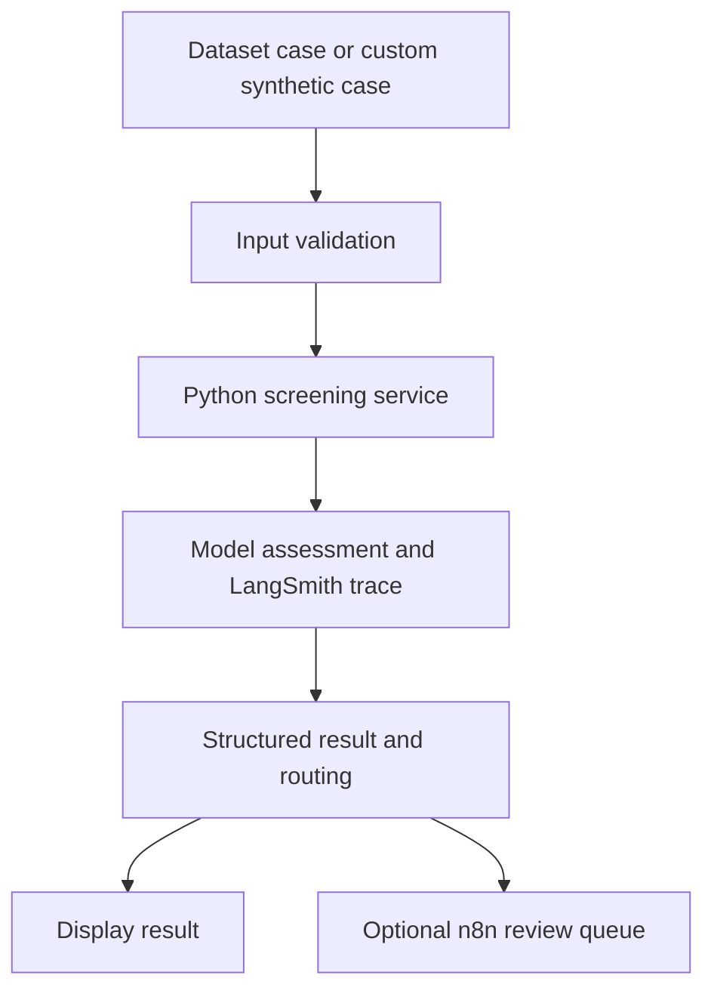

# Round 2 MVP Implementation Plan

## 1. Purpose

The Clinical-Trial Eligibility Copilot is a human-reviewed AI decision-support prototype for criterion-level clinical-trial prescreening.

Round 2 extends the existing Python screening service, n8n workflow, Notion demonstration queue, Tableau dashboard and LangSmith evidence into:

- a working Streamlit MVP;
- reproducible model and prompt comparison;
- stronger validation and error handling;
- an end-to-end demonstration;
- complete business, risk and compliance documentation;
- a realistic proposal for a controlled client pilot;
- a final presentation and recorded demonstration.

The MVP uses public synthetic TrialGPT-derived data only. It must not process real patient data or make final eligibility or enrolment decisions.

## 2. Separation of plans

This document describes implementation of the capstone MVP.

It is separate from:

- `client_project_plan.md`, which will describe a realistic client implementation using user stories, acceptance criteria, sprints, decision gates, a Definition of Done and an indicative pilot timeline;
- `strategic_plan.md`, which will describe the broader POC → pilot → production pathway, stakeholder engagement and commercialisation.

The Streamlit application, synthetic dataset and Notion queue demonstrate the product concept. They do not represent the intended production architecture.

## 3. Objectives

1. Create a functional Streamlit application that can be run locally.
2. Support existing dataset cases and manually entered synthetic cases.
3. Produce structured, inspectable criterion-level assessments.
4. Keep ground truth separate from model input.
5. Route uncertain cases to human review.
6. Connect qualifying cases to the existing n8n demonstration workflow.
7. Compare selected models and prompt versions reproducibly.
8. Evaluate safety, uncertainty handling, performance, latency and cost.
9. Maintain LangSmith observability for model calls.
10. Provide basic error handling and clear user feedback.
11. Complete all required Round 2 consulting documentation.
12. Preserve the relevant Round 1 evidence and explicitly document the KEEP decision.

## 4. Delivery principles

Implementation will proceed in small, reviewable increments.

For each increment:

1. define the intended outcome and acceptance criteria;
2. inspect the relevant existing code and documentation;
3. identify affected files;
4. implement only the agreed scope;
5. run automated and manual tests;
6. review the Git diff;
7. update related documentation;
8. commit only after the increment is accepted.

Safety, reproducibility and traceability take priority over additional features or visual polish.

## 5. MVP scope

### In scope

- Streamlit interface;
- dependent dataset selection:
  - Patient ID;
  - Trial ID;
  - Criterion ID;
- display of the selected synthetic patient summary and criterion;
- custom synthetic-case entry;
- input validation and sentence numbering;
- criterion-level AI assessment;
- structured output:
  - predicted label;
  - rationale;
  - evidence-sentence references;
  - review route;
  - model and prompt version;
  - latency and token usage;
- optional explicit submission to the n8n review queue;
- visible queue success or failure;
- LangSmith tracing of model calls;
- evaluation mode with ground-truth comparison;
- model and prompt comparison;
- result exports;
- basic error handling;
- local setup and reproduction documentation.

### Out of scope

- real patient or identifiable health data;
- live EHR, data warehouse or CTMS integration;
- final eligibility or enrolment decisions;
- automated enrolment;
- diagnosis or treatment recommendations;
- production authentication and authorisation;
- production cybersecurity and availability guarantees;
- automatic write-back to clinical systems;
- full clinical validation;
- medical-device certification;
- production regulatory approval.

## 6. Intended MVP flow



LangSmith observes the model call in Python. n8n does not make a separate LangSmith HTTP request.

## 7. Implementation phases

### Phase 0 — Baseline audit and scope freeze

#### Tasks

- Inspect the current repository and working tree.
- Confirm which Round 1 artifacts remain authoritative.
- Verify the current Python environment and dependencies.
- Run the existing unit tests.
- Validate the existing n8n workflow JSON.
- Confirm the current baseline prediction and metrics files.
- Record the Round 1 baseline model and prompt version.
- Check `.env.example` without exposing `.env`.
- Identify outdated paths and documentation.
- Preserve the intentional temporary deletion of the Tableau workbook until its updated version is ready.

#### Outputs

- confirmed repository baseline;
- confirmed Round 1 evaluation baseline;
- documented list of required updates;
- frozen MVP scope.

#### Completion gate

- Existing code compiles.
- Existing tests pass or known failures are documented.
- Required data files are available.
- No secrets are exposed.
- The next implementation step can proceed without unresolved structural assumptions.

---

### Phase 1 — AI product-management definition

#### Tasks

Create `client_project_plan.md` as the realistic AI product-management proposal for a client pilot.

It will include:

- product vision;
- target organisation and current state;
- stakeholders and responsibilities;
- Jobs-to-be-Done;
- user stories;
- acceptance criteria;
- Definition of Ready;
- Definition of Done;
- prioritised backlog;
- sprint structure;
- timeline and milestones;
- risks and dependencies;
- pilot decision gates;
- measurable pilot outcomes.

Separate:

- capstone MVP user stories;
- future client-pilot user stories;
- production requirements that are outside the MVP.

#### Outputs

- `client_project_plan.md`;
- agreed MVP acceptance criteria;
- prioritised implementation backlog.

#### Completion gate

- MVP requirements are testable.
- Client-pilot requirements are realistic.
- Demo functionality is not confused with production readiness.
- Out-of-scope boundaries remain explicit.

---

### Phase 2 — Reusable application foundation

#### Tasks

- Inspect the existing screening and validation modules.
- Identify logic that can be reused by scripts, notebooks and Streamlit.
- Add a reusable loader for dataset cases if needed.
- Add reusable review-routing logic if needed.
- Keep model invocation outside the user-interface code.
- Keep ground truth outside the model prompt.
- Add deterministic helper tests.
- Avoid unnecessary refactoring of working Round 1 code.

#### Expected capabilities

- load and join patient, trial and criterion data;
- filter trials for a selected patient;
- filter criteria for a selected patient–trial pair;
- construct a valid screening case;
- validate custom synthetic input;
- assign a review route from a structured result;
- return understandable validation errors.

#### Completion gate

- Reusable functions operate independently of Streamlit.
- Dataset records map correctly across IDs.
- Custom input validation works.
- Ground truth is not included in model input.
- Deterministic tests pass without paid API calls.

---

### Phase 3 — Streamlit MVP

#### Tasks

Create the MVP under `mvp/`.

#### Dataset-case mode

- Select a Patient ID.
- Restrict Trial ID choices to relevant records.
- Restrict Criterion ID choices to the selected patient and trial.
- Display the synthetic patient summary.
- Display criterion type and criterion text.
- Run a criterion-level assessment.
- Hide the ground-truth label until prediction is complete.
- Optionally reveal evaluation comparison after prediction.

#### Custom synthetic-case mode

- Enter a fictional patient summary.
- Select inclusion or exclusion criterion type.
- Enter criterion text.
- Validate missing or invalid fields.
- Number patient-summary sentences before screening.
- Display a warning not to enter real patient information.
- Do not calculate accuracy metrics because verified ground truth is unavailable.

#### Result display

Show:

- predicted label;
- concise rationale;
- evidence-sentence references;
- review route;
- model;
- prompt version;
- latency;
- token usage where available;
- errors or warnings.

#### Review-queue action

- Show an explicit queue-submission button only when review is required.
- Do not submit automatically.
- Display queue success or failure clearly.
- Do not claim that a queue record exists after a failed request.
- Preserve the assessment result if n8n or Notion is unavailable.

#### Completion gate

- A dataset case runs end to end.
- A custom synthetic case runs end to end.
- Invalid input is rejected clearly.
- A model or integration failure does not crash the application.
- Human-review boundaries are visible.
- Manual acceptance testing is completed.

---

### Phase 4 — Model and prompt comparison

#### Evaluation design

The existing 120 criterion-level assessments remain the Round 1 reference benchmark.

Because the benchmark has already been analysed, it must not be described as a completely untouched external test set.

For Round 2:

1. create a deterministic, stratified development and holdout assignment;
2. use the development portion for prompt refinement;
3. use the Round 2 holdout portion for final comparison;
4. report full-cohort results separately for comparability with Round 1;
5. preserve the existing GPT-4.1 and `v2_abstention_rules` output as the baseline.

#### Model comparison

- Confirm candidate model availability and pricing before execution.
- Compare the baseline with at least one lower-cost candidate.
- Add a stronger candidate only if it provides meaningful decision value within the available time and budget.
- Use the same prompt and cases for the initial model comparison.
- Record model name, prompt version, parameters and timestamp.

#### Prompt comparison

Evaluate controlled prompt changes, such as:

- stronger prohibition against unsupported inference;
- explicit handling of missing evidence;
- clearer distinction between `UNKNOWN` and `NOT_APPLICABLE`;
- conservative exclusion-criterion handling;
- exact evidence-sentence requirements;
- strict output schema;
- concise rationale requirements.

Assign a new version to every prompt variant. Do not silently overwrite the baseline prompt.

#### Primary metrics

- unsafe MET rate;
- UNKNOWN recall;
- exact agreement;
- review rate;
- invalid-output rate;
- latency;
- estimated cost.

Safety-oriented metrics take priority over exact agreement.

#### Outputs

- reproducible comparison script;
- `notebooks/02_model_comparison.ipynb` for analysis and visualisation;
- preserved raw model outputs;
- comparison tables or charts;
- concise model-selection rationale;
- updated evaluation summary.

#### Completion gate

- Candidate runs use comparable settings.
- Baseline files remain unchanged.
- Results can be reproduced from documented commands.
- The recommended model and prompt are justified by evidence.
- Evaluation limitations are stated clearly.

---

### Phase 5 — Workflow integration and observability

#### n8n

- Confirm the exported workflow matches the working version.
- Test both queue-required and no-queue branches.
- Test a queue failure where practical.
- Confirm that qualifying cases create the expected n8n and Notion records.
- Capture updated screenshots.
- Preserve the evaluation-only label on ground-truth-based safety escalation.

#### LangSmith

- Confirm model calls generate traces.
- Verify model, prompt, input, output, latency and token metadata.
- Capture updated monitoring evidence.
- Where practical, use a shared assessment identifier to correlate screening and workflow records.
- Do not send a duplicate LangSmith request from n8n.

#### Completion gate

- Both n8n branches work.
- Queue status is reported accurately.
- LangSmith evidence corresponds to the demonstrated model call.
- Demo limitations are documented.

---

### Phase 6 — Business, risk and compliance package

#### Required documents

Complete or replace:

- `roi_risk_assessment.md`;
- `compliance/eu_ai_act_compliance.md`;
- `compliance/gdpr_documentation.md`;
- `strategic_plan.md`.

#### ROI and risk

Include:

- upfront costs;
- ongoing costs;
- quantified business value;
- 12- and 36-month ROI;
- break-even;
- explicit assumptions;
- at least six regulatory, technical, ethical and operational risks;
- likelihood, impact and mitigation.

#### EU AI Act

Include:

- intended-purpose analysis;
- step-by-step risk classification;
- provider and deployer responsibilities;
- applicable high-risk requirements if the production use is classified as high-risk;
- conformity-assessment summary;
- technical-documentation outline;
- explicit distinction between the synthetic MVP and intended production use.

#### GDPR

Include:

- production data-flow map;
- processing-activities register;
- purpose and possible legal-basis analysis;
- Article 9 condition analysis;
- data minimisation;
- retention;
- recipients;
- data-subject rights;
- short DPIA;
- processor and subprocessor considerations;
- international-transfer considerations.

Do not assume that consent is automatically the appropriate legal basis.

#### Strategic plan

Include:

- POC → controlled pilot → full deployment;
- milestones and decision gates;
- stakeholder communication;
- KPIs by phase;
- buyer and user groups;
- pricing and commercialisation concept;
- differentiators;
- pilot-to-production greenlight criteria.

#### Completion gate

- Every required section is present.
- Assumptions are explicit.
- Legal conclusions are presented as reasoned project analysis, not formal legal advice.
- MVP and production conditions are clearly separated.
- Business figures are internally consistent.

---

### Phase 7 — Documentation and demonstration

#### Repository documentation

Create or update:

- `README.md`;
- `.env.example`;
- `requirements.txt`;
- `mvp/mvp_documentation.md`;
- `poc/poc_documentation.md`;
- dashboard documentation;
- LangSmith monitoring documentation;
- evaluation documentation;
- `feedback/round1_decision.md`;
- final repository structure.

#### MVP documentation

Include:

- purpose;
- architecture;
- setup;
- required environment variables;
- run command;
- dataset and custom-case workflows;
- expected outputs;
- error handling;
- n8n integration;
- LangSmith monitoring;
- synthetic-data boundary;
- limitations versus production.

#### Demonstration

- Prepare a reproducible end-to-end scenario.
- Record a two- to five-minute demonstration.
- Keep a backup recording for presentation use.
- Avoid exposing credentials, webhook secrets or API keys.
- Show one human-review case and one no-review case.

#### Dashboard

- Return the updated Tableau workbook to `dashboard/` before final submission.
- Verify that the documentation and screenshot correspond to the final workbook.
- Re-run or verify the metrics source used by the dashboard.

#### Completion gate

- A new user can run the MVP from the documentation.
- The demonstration matches the repository implementation.
- Round 1 artifacts remain present or are clearly linked.
- Required files use their expected names and locations.

---

### Phase 8 — Final verification and handover

#### Automated checks

Run the relevant checks from the repository root:

```bash
python -m compileall -q src mvp
pytest -q
python -m json.tool poc/n8n_workflow.json > /dev/null
python -m json.tool poc/sample_input.json > /dev/null
python -m json.tool poc/sample_output.json > /dev/null
git diff --check
```

#### Manual checks

- Start the Streamlit application from a clean terminal.
- Run a dataset case.
- Run a custom synthetic case.
- Test invalid input.
- Test a review-required case.
- Test a no-review case.
- Verify n8n and Notion behaviour.
- Verify a corresponding LangSmith trace.
- Check that no secret or real patient data is present.
- Review all links, screenshots and commands.
- Confirm that the updated Tableau workbook is included.
- Confirm that the final presentation and demo are included or linked.

#### Final completion gate

The project is complete only when:

- the MVP runs locally;
- the core AI capability executes successfully;
- basic error handling is demonstrated;
- model and prompt selection are evidence-based;
- human review remains explicit;
- all Round 2 documents are complete;
- the client project plan is realistic;
- the presentation and demo match the delivered system;
- the repository passes final verification;
- no secrets or real patient data are committed.

## 8. Dependency order

| Workstream | Depends on |
|---|---|
| Baseline audit | Existing Round 1 repository |
| AI product-management definition | Baseline audit and frozen scope |
| Reusable application foundation | Baseline audit |
| Streamlit MVP | Reusable application foundation |
| Model and prompt comparison | Stable screening and evaluation functions |
| n8n integration | Stable structured MVP output |
| Compliance and ROI documentation | Frozen intended use and client scenario |
| Strategic plan | ROI, risk, compliance and pilot assumptions |
| Final documentation and presentation | Completed MVP and analysis |
| Final verification | All required deliverables |

Documentation work may proceed in parallel once the intended use, scope and architecture are frozen.

## 9. Prioritisation and buffer protection

### Must complete

- working Streamlit MVP;
- dataset and custom synthetic modes;
- structured criterion-level assessment;
- validation and basic error handling;
- human-review routing;
- reproducible model comparison;
- required Round 2 documents;
- client project plan;
- updated README and MVP documentation;
- final presentation and demo;
- final repository verification.

### Should complete

- working n8n submission from Streamlit;
- shared assessment identifier across components;
- refreshed Tableau workbook and dashboard evidence;
- updated LangSmith screenshots;
- comparison visualisations;
- deployment or hosted demonstration if reliable.

### Could complete

- additional UI polish;
- additional model candidates;
- richer dashboard interactivity;
- extended queue-management features;
- additional automated tests beyond critical paths.

If time becomes constrained, remove Could items first and then non-essential Should items. Do not reduce safety boundaries, required documentation, core testing or reproducibility.

## 10. Implementation Definition of Done

An implementation increment is complete only when:

- its acceptance criteria are satisfied;
- relevant tests pass;
- manual behaviour has been checked where necessary;
- documentation is updated;
- no baseline evidence is overwritten unintentionally;
- no secrets or real patient data are introduced;
- limitations are stated;
- human-review boundaries remain explicit;
- the Git diff contains only intended changes.