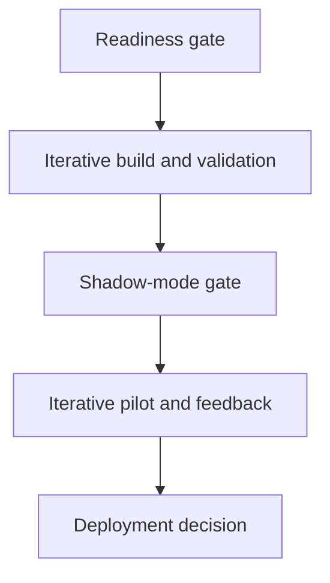

# Project Management Plan

## Clinical-Trial Eligibility Copilot

**Document purpose:** Internal learning and IHK defence reference
**Scenario client:** HelixBridge Clinical Research Network GmbH
**Client status:** Fictional company created for this project
**Plan date:** 3 September 2026
**Delivery model:** Consulting-led implementation

> This document explains how the proposed project would be governed and delivered in a realistic client environment. It is not intended to be presented in full. The presentation should extract only the principal management approach, timeline, responsibilities and decision gates.

---

## 1. Why Project Management Matters Here

This is not only an AI-development project. It combines:

- business-process change;
- clinical safety and human oversight;
- personal health-data processing;
- model and prompt evaluation;
- integration with client systems;
- user training and adoption;
- supplier and contract management;
- financial validation.

A technically functional model is therefore only one project output. Successful delivery means that the complete workflow is useful, safe, lawful, supportable and economically justified.

The project manager must coordinate technical delivery with clinical, operational, privacy, security, quality and financial decisions. No technical sprint can bypass a mandatory approval gate.

---

## 2. Recommended Management Approach

### 2.1 Hybrid approach

The project uses a **hybrid delivery model**:

- **Stage-gated governance** controls investment, safety, compliance and progression between phases.
- **Iterative delivery** is used inside each approved phase to build, test and improve the workflow in short cycles.

This is more appropriate than using either approach alone.

| Approach | Strength | Limitation for this project |
|---|---|---|
| Pure waterfall | Clear sequence and documentation | Learns too slowly from users and model behaviour |
| Pure agile | Fast feedback and adaptation | May understate formal clinical, privacy and investment approvals |
| Hybrid | Iterative learning inside controlled gates | Requires disciplined ownership and documentation |

### 2.2 What this means in practice

Within a build or pilot phase, the team may work in one- or two-week cycles. At a phase boundary, the steering committee reviews formal evidence and chooses `STOP`, `PIVOT` or `CONTINUE`.

---

## 3. Project Objectives

### 3.1 Business objective

Determine whether AI-assisted criterion assessment can reduce net coordinator preparation time and improve consistency without increasing safety, privacy or operational risk.

### 3.2 Pilot objectives

- validate one trial across two sites and four coordinators;
- test approximately 150 patient–trial reviews per month;
- compare the complete assisted workflow with the measured manual baseline;
- establish whether review and escalation workload remains manageable;
- verify meaningful human confirmation and source traceability;
- produce evidence for a full-deployment decision.

### 3.3 Non-objectives

The project does not aim to automate final eligibility, patient exclusion, candidate contact, treatment decisions or enrolment.

---

## 4. Scope Management

### 4.1 In scope for the pilot

- one moderate-complexity actively recruiting trial;
- two HelixBridge sites;
- four trained coordinators;
- approved patient–trial combinations;
- criterion-level structured outputs;
- evidence references and rationales;
- coordinator confirmation and override;
- additional escalation for uncertain and defined high-risk cases;
- limited approved system integration;
- privacy, security, validation and monitoring controls;
- pilot evaluation and business-case update.

### 4.2 Out of scope

- autonomous patient search across the complete network;
- final eligibility or enrolment decisions;
- automatic patient contact;
- diagnosis or treatment support;
- deployment across all eight trials during the pilot;
- additional countries;
- unrestricted free-text access to complete health records;
- replacement of existing clinical or trial systems.

### 4.3 Scope-control rule

Every proposed change is evaluated for:

1. business value;
2. clinical impact;
3. privacy and security impact;
4. regulatory classification impact;
5. schedule and cost;
6. validation and documentation effort.

Material changes require steering-committee approval. A new feature is not “small” if it changes intended purpose, data access, human authority or regulatory status.

---

## 5. Work Breakdown Structure

| Workstream | Principal outputs |
|---|---|
| Programme management | Charter, roadmap, budget, status, decisions and dependency management |
| Clinical and workflow | Current-state map, intended use, criteria interpretation, escalation and SOPs |
| Data and integration | Data dictionary, interface contract, pseudonymisation and data-quality controls |
| AI and evaluation | Frozen configuration, prompts, evaluation set, metrics, tests and error analysis |
| Application and workflow | User interface, validation, review workflow, audit events and fallback |
| Privacy and legal | Role analysis, lawful basis, DPIA, processors, transfers and notices |
| Security and operations | Threat model, access, monitoring, incident, backup, recovery and support |
| Change and adoption | Co-design, training, user feedback, adoption and communications |
| Business case | Baseline, costs, benefits, sensitivity, KPI results and recommendation |

Each workstream has one accountable client owner and one provider delivery lead. Cross-workstream dependencies are maintained in the integrated plan rather than managed independently.

---

## 6. Timeline and Management Gates

| Period | Phase | Management output | Gate decision |
|---|---|---|---|
| Completed | Synthetic POC | Feasibility, MVP, evaluation and limitations | Plan readiness |
| Month 1 | Readiness assessment | Baseline, scope, architecture, compliance gaps and pilot charter | Stop, pivot or approve pilot |
| Months 2–3 | Build and offline validation | Controlled environment, tests, training and readiness evidence | Start shadow mode or remediate |
| Month 4 | Shadow mode | Independent workflow, safety and routing evidence | Stop, pivot or start assisted mode |
| Months 5–6 | Assisted pilot | Time, workload, adoption, safety and usability results | Complete evaluation |
| End of month 6 | Pilot decision | Updated ROI, risk and residual-risk record | Stop, pivot or approve deployment |
| Months 7–11 | Conditional deployment | Four-site rollout in controlled waves | Transfer each wave to operations |
| Month 12 onward | Stabilisation | Operational KPI and governance cycle | Maintain, narrow or scale |

If evidence is incomplete, the gate is delayed or the scope is reduced. Mandatory controls are not removed to preserve the original date.

---

## 7. Governance Structure

### 7.1 Governance levels

| Level | Participants | Purpose | Cadence |
|---|---|---|---|
| Steering committee | Executive sponsor, Clinical Operations, clinical owner, IT, control owners, provider lead | Investment, scope, residual risk and phase decisions | Monthly and at gates |
| Delivery team | Provider leads, client product owner, IT/data and workstream representatives | Plan work, resolve dependencies and manage delivery | Weekly |
| Clinical and quality review | Clinical owner, coordinators, quality and AI lead | Review disagreements, safety, workflow and validation | Fortnightly; weekly in pilot |
| Privacy and security review | DPO, security, IT and provider specialists | Review data flow, vendors, controls and incidents | At design and gates; ad hoc for incidents |
| User forum | Pilot coordinators and product owner | Usability, workload, training and feedback | Weekly during pilot |

### 7.2 Decision principle

Commercial value does not override a failed safety, privacy, security or human-control gate. The person accountable for a control must approve or reject the corresponding evidence.

---

## 8. RACI Matrix

**R = Responsible, A = Accountable, C = Consulted, I = Informed**

| Activity | Executive sponsor | Clinical owner | Clinical Operations | Client IT | DPO/security/quality | Provider lead | Provider technical team |
|---|---|---|---|---|---|---|---|
| Approve business scope and funding | A | C | C | I | I | R | I |
| Define intended use and clinical boundaries | I | A | R | I | C | C | C |
| Measure workflow baseline | I | C | A/R | I | I | C | I |
| Approve patient-data processing | A | C | C | R | C | C | C |
| Design production architecture | I | C | C | A/R | C | C | R |
| Build and test solution | I | C | C | C | C | A | R |
| Define clinical validation thresholds | I | A | C | I | R/C | C | C |
| Train pilot users | I | C | A | I | C | R | C |
| Operate human review workflow | I | C | A/R | I | I | C | I |
| Investigate safety-significant error | I | A | R | C | C | C | R |
| Approve pilot progression | A | R | C | C | C | C | I |
| Approve full deployment | A | R | C | C | C | C | I |

Each activity has one accountable owner in the RACI. This does not remove control-owner authority: clinical, privacy, security, quality and IT owners must provide the required concurrence for their domains and can block progression when a mandatory gate fails. The steering committee records the integrated decision.

---

## 9. Delivery Rhythm

### Weekly delivery meeting

- progress against plan;
- current sprint or work package;
- dependencies and blockers;
- risks, issues and decisions required;
- changes to scope, cost or timing;
- actions, owner and due date.

### Fortnightly clinical review

- safety-significant disagreements;
- evidence quality and missing data;
- routing and review workload;
- subgroup observations;
- clinical-rule or prompt questions;
- decisions requiring documentation.

### Monthly steering committee

- milestone status;
- budget and forecast;
- KPI and risk summary;
- major decisions and changes;
- compliance status;
- readiness for the next gate.

### Pilot user forum

- workflow friction;
- time and workload;
- trust and explanation quality;
- training needs;
- defects and improvement proposals.

---

## 10. Core Management Artefacts

| Artefact | Purpose | Owner | Update frequency |
|---|---|---|---|
| Project charter | Defines objective, scope, governance and authority | Programme lead | At approval and material change |
| Integrated roadmap | Shows phases, milestones and dependencies | Programme lead | Weekly |
| RACI | Clarifies responsibility and accountability | Programme lead | At phase changes |
| Product backlog | Prioritises features, controls and defects | Product owner | Weekly |
| Risk register | Tracks likelihood, impact, mitigation and residual risk | Programme lead/control owners | Weekly; formal at gates |
| Issue log | Tracks active problems requiring resolution | Delivery lead | Continuous |
| Decision log | Records what was decided, by whom and why | Programme lead | At every material decision |
| Change log | Tracks approved changes and their impact | Product owner | Continuous |
| Validation plan and report | Defines and records evidence against acceptance criteria | Quality/AI lead | Per release and gate |
| KPI dictionary | Prevents ambiguous metric interpretation | Business owner | Before pilot; controlled changes |
| Budget and benefits tracker | Compares forecast, actual cost and value | Finance/programme lead | Monthly |
| Communications plan | Defines stakeholder information and cadence | Programme lead | At each phase |
| Release record | Connects model, prompt, code, data and approval versions | Technical/quality lead | Every release |

The important management principle is traceability: requirement → implementation → test → approval → release → monitored result.

---

## 11. Risk, Issue and Decision Management

### Risk versus issue

- A **risk** is an uncertain event that may occur, such as delayed data access.
- An **issue** has already occurred, such as the interface not being available on the agreed date.

Risks have likelihood, impact, mitigation, owner and review date. Issues have severity, corrective action, owner and deadline.

### Escalation

Immediate escalation is required for:

- suspected personal-data breach;
- human-control bypass;
- unsafe automatic action;
- unresolved critical safety finding;
- unapproved production change;
- inability to verify source-data integrity;
- review backlog preventing meaningful oversight.

### Decision log

Each material decision records:

- decision and date;
- decision owner;
- evidence considered;
- alternatives rejected;
- assumptions and conditions;
- affected scope, cost, risk and documents;
- review or expiry date where applicable.

---

## 12. Change Management

The project distinguishes ordinary configuration from material change.

| Example | Typical treatment |
|---|---|
| Correct interface text | Normal backlog and testing |
| Adjust non-clinical dashboard layout | Normal backlog and user acceptance |
| Change prompt or model | Regression evaluation and controlled release |
| Add patient-data field | Privacy, necessity, security and validation review |
| Add a materially different trial | Clinical and data validation; possible new pilot |
| Automate exclusion or patient contact | Intended-purpose, GDPR, AI Act and clinical reassessment |
| Add a new external vendor | Procurement, DPA, security and transfer review |

A material change cannot be hidden inside a normal sprint. It returns to the relevant governance gate.

---

## 13. Quality and Acceptance Management

### Definition of Done for a feature

A feature is complete only when:

- requirements and acceptance criteria are documented;
- code and configuration are reviewed;
- deterministic and relevant integration tests pass;
- privacy and security controls are addressed;
- error and fallback behaviour is tested;
- user and technical documentation is updated;
- traceability to the release is recorded;
- required owner approval is obtained.

### Definition of Done for the pilot

The pilot is complete only when:

- planned shadow and assisted periods are completed;
- all material incidents and disagreements are evaluated;
- safety, routing, reliability, workload, time and adoption KPIs are reported;
- privacy, security and quality findings are closed or explicitly accepted;
- actual and forecast cost are reconciled;
- ROI is recalculated with measured evidence;
- residual risks and lessons learned are documented;
- the steering committee records `STOP`, `PIVOT` or `CONTINUE`.

---

## 14. KPI Management

| Dimension | Gate indicator |
|---|---|
| Human control | Zero actions without documented human confirmation |
| Safety | Zero unresolved critical safety events |
| Model/workflow quality | Clinically approved unsafe-error and review-routing thresholds |
| Traceability | At least 95% complete evidence and configuration provenance |
| Reliability | At least 95% valid-request completion |
| Efficiency | At least 25% net preparation-time reduction |
| Adoption | At least 80% of assigned users active and compliant |
| Workload | Escalation queue remains within agreed capacity and SLA |
| Privacy/security | Zero material breach or unresolved critical finding |
| Economics | Updated 36-month business case accepted by sponsor and Finance |

Metrics must have an owner, exact formula, source, measurement frequency and target. A dashboard without a KPI dictionary is not sufficient management control.

---

## 15. Budget and Commercial Control

The provider engagement is divided into separately approved commitments:

| Commitment | Illustrative provider fee | Approval point |
|---|---:|---|
| Readiness | €10,000–€15,000 | Initial client decision |
| Controlled pilot | €35,000–€55,000 | After readiness |
| Full deployment | €50,000–€90,000 | After pilot |
| Ongoing support | €18,000–€36,000 annually | Before operational transfer |

Client internal labour, infrastructure and third-party licences are tracked separately and included in the total cost of ownership.

Monthly financial control compares:

- approved budget;
- committed cost;
- actual cost;
- forecast to complete;
- contingency remaining;
- validated benefits;
- scope or schedule effects.

The phased contract limits sunk cost. A negative full-deployment ROI does not invalidate the readiness assessment if that assessment prevents a larger unsuitable investment.

---

## 16. Management of the Prompt-Improvement Work

Prompt improvement is treated as controlled product development, not as informal experimentation.

1. Document the failure patterns and improvement objective.
2. Define the new prompt version and change hypothesis.
3. Use development examples without altering reference labels.
4. Freeze the candidate prompt before final evaluation.
5. Run the complete locked synthetic cohort using the same model configuration.
6. Report accuracy, label-level performance, unsafe errors, review routing, workload proxy, latency and cost.
7. Compare against the current baseline without replacing unfavourable results.
8. Approve or reject the prompt version and update all reported figures consistently.

Because the current cohort has already informed development, it is not a fully independent holdout. A separate locally adjudicated set is required before pilot approval.

---

## 17. Likely IHK Defence Questions

### Why did you choose a hybrid approach?

The technical workflow requires iteration, but clinical safety, privacy and investment decisions require formal evidence and approval. Agile cycles are used inside phases; stage gates control progression.

### Who owns the final decision?

The steering committee approves project progression. Qualified coordinators and investigators retain patient-level decisions. Clinical, privacy, security and IT owners can block progression when their mandatory controls fail.

### How do you prevent scope creep?

The pilot is fixed to one trial, two sites and four coordinators. Every material change receives an impact assessment covering purpose, risk, validation, cost and schedule.

### What happens when the model performs badly?

The team investigates the error, preserves the evidence, applies the stop criteria where necessary and decides whether to improve, narrow or stop. A more expensive model is not assumed to be better.

### Why invest when the current 36-month ROI is weak?

Only readiness is recommended immediately. It validates whether the real workflow can support a stronger case. The pilot is a separate bounded investment, and full deployment is not approved unless measured evidence supports it.

### How is human oversight made meaningful?

Reviewers see the source, understand limitations, have time and authority to override, and record the final decision. Workload and overrides are monitored. Uncertain and high-risk cases receive additional senior review.

### How do you know the project is successful?

Success combines safety, traceability, reliability, time, review workload, adoption, privacy, security and economics. Accuracy alone is insufficient.

### What is the provider’s role after deployment?

The provider supports the application, evaluation and controlled updates. HelixBridge owns the process, production environment, data and clinical decisions.

---

## 18. Presentation Extraction

For a single management slide, use:

**Headline:** Controlled investment through measurable decision gates

- Hybrid delivery: iterative build inside formal stage gates
- Scope: one trial, two sites, four coordinators
- Timeline: readiness in month 1; pilot evidence by month 6; conditional rollout in months 7–11
- Governance: steering committee plus named clinical, IT, privacy, security and provider owners
- Controls: RACI, risk register, KPI dictionary, decision log and change control
- Decision: `STOP / PIVOT / CONTINUE` at readiness, shadow mode, pilot completion and rollout waves

**Closing statement:** Safety and compliance gates cannot be overridden by schedule or expected ROI.

---

## 19. Final Management Position

The project should proceed as a sequence of evidence-based commitments, beginning with the four-week readiness assessment. Management success is not delivering an AI feature on time; it is enabling HelixBridge to make a well-supported decision about whether the workflow should stop, change or scale.

The project manager protects this decision quality by maintaining scope, ownership, evidence, risk, cost and change traceability throughout the engagement.
