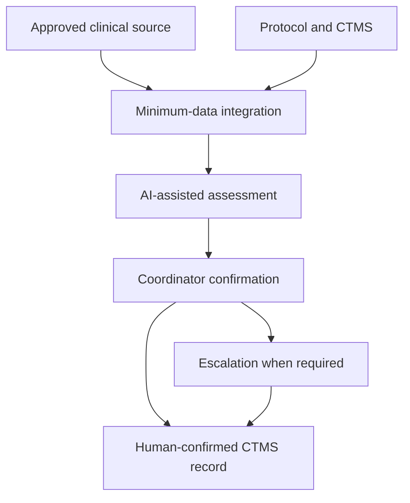

# Strategic Deployment and Commercialisation Plan

## Clinical-Trial Eligibility Copilot

**Document status:** Client-facing proposal  
**Plan date:** 3 September 2026  
**Prepared for:** HelixBridge Clinical Research Network GmbH  
**Client status:** Fictional company created for this project  
**Commercial model:** Consulting-led implementation  
**Initial scope:** Germany, with optional later expansion to selected EU operations

> Organisation size, workflow volumes, costs and expected benefits are planning assumptions derived from a hypothetical pre-proposal discovery. They will be validated during the readiness assessment before becoming contractual commitments.

---

## 1. Executive Summary

HelixBridge operates four clinical research sites with 12 coordinators and eight actively recruiting trials. Its coordinators are assumed to complete approximately 600 patient–trial prescreening reviews each month. The current process is predominantly manual and requires repeated navigation between patient information, protocol criteria and trial-management systems.

The Clinical-Trial Eligibility Copilot is proposed as an AI-assisted preparation and review tool. It creates criterion-level assessments, rationales and evidence references for qualified staff. It does not determine final eligibility, exclude or prioritise patients, contact candidates, make treatment recommendations or enrol participants.

The proposed engagement follows four controlled phases:

1. **Proof of concept — completed:** technical workflow demonstrated with public synthetic data.
2. **Readiness and controlled pilot:** one moderate-complexity trial, two sites and four coordinators.
3. **Conditional full deployment:** staged expansion to the four-site network only after the pilot meets all mandatory gates.
4. **Optional scale:** additional trials, sites or markets after the operating model is proven repeatable.

The proof of concept established technical feasibility but not production readiness. On the locked 120-assessment synthetic cohort, GPT-4.1 achieved 72.5% exact agreement and GPT-5.6 Sol achieved 65.0%; each produced one unsafe `MET` result among 17 reference `NOT_MET` cases. A more expensive model therefore did not solve the quality problem. Prompt and workflow improvement, safety-focused validation and mandatory human confirmation remain necessary.

The recommended next commitment is a fixed-price readiness assessment. A controlled pilot proceeds only if data, legal, security and clinical conditions are satisfied. Full deployment is a separate investment decision based on measured pilot evidence.

---

## 2. Client and Use-Case Scope

### 2.1 Planning profile

| Attribute | Planning assumption |
|---|---:|
| Research sites | 4 |
| Clinical research coordinators | 12 |
| Active recruiting trials | 8 |
| Prescreening volume | Approximately 600 unique patient–trial combinations per month |
| Current preparation time | Approximately 30 minutes per review |
| Pilot scope | 1 trial, 2 sites, 4 coordinators |
| Pilot volume | Approximately 150 patient–trial reviews per month |

A patient evaluated against three trials represents three patient–trial reviews. Readiness will verify both the unit of work and the assumed volumes.

### 2.2 Intended use

The solution prepares criterion-level prescreening assessments using approved patient information and controlled trial criteria. It supports coordinators by organising evidence, identifying missing information and standardising documentation.

Every result is confirmed by a coordinator in the ordinary workflow. `UNKNOWN`, `NOT_APPLICABLE`, conflicting and otherwise designated high-risk results receive additional escalation to a senior reviewer or investigator.

### 2.3 Prohibited uses

The solution must not:

- determine final trial eligibility;
- automatically exclude or deprioritise a patient;
- contact or enrol a candidate automatically;
- diagnose or recommend treatment;
- replace source verification or qualified clinical judgement;
- use ground-truth evaluation labels in live operations;
- send patient data to unapproved services or logs.

---

## 3. Target Production Workflow

### Operating principles

- Existing clinical systems, the protocol repository and CTMS remain authoritative.
- Only minimum-necessary, preferably pseudonymised data is processed.
- Direct identifiers remain in the client source environment wherever possible.
- Production runs in a client-controlled or client-approved EU environment.
- The client’s identity, access, security, logging and retention controls apply.
- Model, prompt, evidence, routing, reviewer and final-decision metadata remain traceable.
- Manual processing remains available during outages or suspension.

The current Streamlit interface, n8n workflow and Notion queue demonstrate the interaction pattern with synthetic data. They are integration placeholders, not proposed production systems of record.

---

## 4. Deployment Roadmap

### Phase 0 — Synthetic proof of concept

**Status:** Completed.

The proof of concept demonstrated structured criterion-level outputs, explicit uncertainty handling, deterministic review routing, a Streamlit demonstration interface, an n8n-to-Notion review handoff, traceable configuration metadata and model comparison on a locked synthetic cohort.

**Decision:** Technical feasibility is sufficient to plan controlled readiness, but present model performance does not support autonomous decisions or immediate real-data deployment.

### Phase 1 — Readiness assessment

**Duration:** 4 weeks  
**Commercial form:** Separate fixed-price engagement

Activities:

- measure workflow volume, handling time, rework and escalations;
- select one moderate-complexity, actively recruiting trial;
- map the clinical source, protocol, CTMS, identity and review systems;
- inspect data availability, quality, provenance and minimisation options;
- confirm controller, processor, legal-basis and Article 9 assumptions;
- complete or initiate the DPIA and regulatory qualification;
- assess security, hosting and integration requirements;
- define the local evaluation set, KPIs, thresholds and stop criteria;
- agree responsibilities, budget, architecture and pilot charter.

**Deliverables:** Baseline report, data-flow map, architecture outline, compliance gap assessment, pilot charter, KPI definitions, cost refinement and `STOP / PIVOT / CONTINUE` recommendation.

### Phase 2 — Controlled pilot

**Duration:** Approximately 18 weeks following readiness approval  
**Scope:** One trial, two sites, four coordinators

#### Stage 2A — Build and offline validation: weeks 1–6

- connect approved non-production or controlled data interfaces;
- implement pseudonymisation, access, logging, retention and deletion controls;
- configure and freeze the model, prompt and routing rules;
- test missing data, invalid outputs, outages and safe fallback;
- validate against an independently adjudicated local test set;
- complete privacy, security, clinical, usability and integration testing;
- train pilot users.

#### Stage 2B — Shadow mode: weeks 7–10

The Copilot runs beside the existing process. Its output is hidden from the original reviewer until the human assessment has been completed, enabling less biased comparison.

#### Stage 2C — Assisted mode: weeks 11–16

Authorised coordinators may use the output to prepare their assessment. They must inspect source evidence and record the final human confirmation or override. High-risk cases receive the defined additional escalation.

#### Stage 2D — Evaluation and decision: weeks 17–18

The joint team evaluates safety, quality, workload, efficiency, adoption, privacy, security and financial evidence. The steering committee records a `STOP`, `PIVOT` or `CONTINUE` decision.

### Phase 3 — Conditional full deployment

**Duration:** Approximately 3–5 months after pilot approval  
**Commercial form:** Separate implementation statement of work

Deployment proceeds in waves:

1. Retain the validated trial at both pilot sites.
2. Extend the validated workflow to the remaining two sites.
3. Add trials with similar data and eligibility characteristics.
4. Validate materially different protocols or therapeutic areas separately.

Production work includes approved system integration, operational monitoring, support, backup and recovery, release governance, rollback, training and site activation.

### Phase 4 — Optional scale

**Earliest timing:** After stable four-site operation

Optional scale may include additional trials, sites, reusable connectors or selected EU operations. Expansion requires repeatable implementation, acceptable support demand, proven client value and market-specific regulatory review.

---

## 5. Indicative Timeline and Milestones

| Period | Milestone | Decision |
|---|---|---|
| Completed | Synthetic POC and initial evaluation | Plan controlled readiness |
| Month 1 | Readiness package and pilot charter | Stop, pivot or approve pilot |
| Months 2–3 | Controlled build and offline validation | Start shadow mode or remediate |
| Month 4 | Shadow-mode evidence | Stop, pivot or start assisted use |
| Months 5–6 | Assisted pilot and final evaluation | Stop, pivot or approve deployment |
| Months 7–11 | Conditional four-site deployment | Transfer to operations by wave |
| Month 12 onward | Stabilisation and optional scale | Expand selectively |

Compliance, data-access or clinical-validation delays move the milestone; they do not reduce mandatory controls.

---

## 6. Delivery Organisation

### 6.1 Provider team

| Role | Responsibility |
|---|---|
| AI consultant and product lead | Scope, requirements, value case, governance and stakeholder coordination |
| AI/data engineer | Data preparation, AI workflow, evaluation, monitoring and technical documentation |
| Integration engineer | Approved source, CTMS, identity and review-workflow interfaces |
| Privacy/security specialist | Privacy-by-design, processor assessment, threat modelling and security controls |
| Clinical subject-matter adviser | Criterion interpretation, safety evaluation and escalation design |

These are roles rather than five full-time positions. Allocation varies by phase.

### 6.2 Client team

| Role | Responsibility |
|---|---|
| Executive sponsor | Funding, strategic direction and final investment decision |
| Head of Clinical Operations | Process and review-queue ownership; benefit realisation |
| Principal investigator or medical lead | Clinical scope, adjudication, safety thresholds and residual clinical risk |
| Four pilot coordinators | Workflow testing, confirmation, overrides and feedback |
| IT/data representative | Environments, interfaces, data quality and operational support |
| DPO/compliance representative | Legal basis, DPIA, transparency, processors and transfers |
| Information-security representative | Architecture, access, vendor assurance and incident readiness |
| Quality/regulatory representative | Validation, SOPs, change control and regulatory qualification |

### 6.3 Working relationship

The provider designs, implements, tests and documents the solution. Client IT controls production environments, accounts and source access. The Head of Clinical Operations owns the live process; the provider does not operate the clinical review queue.

The client owns patient data, operational records, final decisions, production accounts and client-specific configurations. Reusable provider methods and components remain provider intellectual property under an agreed client-use licence. Contracts define responsibilities and liability without removing mandatory obligations from either party.

---

## 7. Pilot KPIs and Deployment Gate

Targets are confirmed before the pilot begins. The following values are proposed planning thresholds.

| Dimension | KPI | Proposed gate |
|---|---|---:|
| Human control | Actions without documented human confirmation | 0 |
| Safety | Unresolved critical safety events | 0 |
| Safety | Unsafe-error rate | Meets pre-approved clinical threshold; every case investigated |
| Review routing | Recall for cases requiring additional review | Meets pre-approved clinical threshold |
| Traceability | Valid outputs with complete source/configuration provenance | At least 95% |
| Reliability | Valid requests completed without unhandled technical errors | At least 95% |
| Efficiency | Net preparation-time reduction including review effort | At least 25% |
| Adoption | Assigned users active and following the workflow | At least 80% |
| Workload | Escalation queue volume and ageing | Within agreed capacity and SLA |
| Privacy/security | Material breach or unresolved critical finding | 0 |
| Fairness | Unresolved material subgroup disparity | 0 before rollout |
| Economics | Updated 36-month business case | Accepted by sponsor and finance |

Full deployment requires all mandatory safety, privacy, security, human-control and regulatory gates. Efficiency or financial value cannot compensate for a failed mandatory control.

---

## 8. Stakeholder Communication

| Audience | Focus | Format and cadence | Owner |
|---|---|---|---|
| Steering committee | Value, cost, risk, milestones and decisions | Monthly; fortnightly near gates | Programme lead |
| Clinical owner and investigators | Safety, disagreements and adjudication | Fortnightly; weekly during live pilot | Clinical owner |
| Coordinators | Workflow, limitations, queue and feedback | Training plus weekly office hour | Product owner |
| Provider and client IT | Interfaces, defects, releases and support | Weekly working group | Technical leads |
| DPO/legal/security/quality | Controls, evidence, incidents and approvals | At each gate and material change | Relevant control owner |
| Site leadership | Staffing, adoption and operational readiness | Biweekly around activation | Deployment lead |
| Patients/candidates | Data use, human decision and rights | Approved notice at required point | Client controller/DPO |

All communication will use the term **AI-assisted prescreening**, report errors and review workload alongside efficiency, and distinguish synthetic evidence from measured pilot results.

---

## 9. Commercial Engagement Model

### 9.1 Consulting-led structure

The offer is a consulting-led implementation rather than a mature standalone clinical software licence.

| Engagement | Scope | Illustrative provider fee |
|---|---|---:|
| Readiness assessment | Four-week baseline, workflow, data, architecture, risk and pilot design | €10,000–€15,000 fixed fee |
| Controlled pilot | One trial, two sites, limited integration, validation, training and evaluation | €35,000–€55,000 fixed fee |
| Full deployment | Production integration, operational controls and four-site rollout | €50,000–€90,000 fixed fee |
| Ongoing support | Monitoring, maintenance, controlled updates and agreed support hours | €18,000–€36,000 per year |
| Material new trial type or integration | New source, substantially different workflow or regulated change | Separately scoped |

These ranges exclude VAT, client internal labour and third-party cloud, model, CTMS or security licences. Where practical, the client contracts directly for underlying services. Final prices follow readiness and architecture confirmation.

### 9.2 Contract sequence

1. Readiness statement of work.
2. Pilot statement of work and required data-processing terms.
3. Production implementation statement of work after pilot approval.
4. Optional support and maintenance agreement.

Payment for a pilot purchases implementation and decision evidence; it does not guarantee production approval.

### 9.3 Business-value principle

The case is evaluated against the complete operating cost, including coordinator review, integration, compliance, support and client participation. Model API charges are only one cost component. Recruitment benefits are counted only when attributable evidence exists, and safety is assessed primarily through quality indicators rather than speculative financial savings.

---

## 10. Commercialisation and Market Approach

### 10.1 Initial customer profile

The offer is suitable for mid-sized multi-site clinical research organisations that have repeated manual prescreening, accessible digital source information, qualified reviewers and sufficient IT and governance maturity for a controlled pilot.

### 10.2 Buyers and decision participants

| Stakeholder | Commercial role | Primary concern |
|---|---|---|
| COO or Managing Director | Economic buyer | Recruitment capacity and controlled investment |
| Head of Clinical Operations | Business owner | Workflow performance and adoption |
| Medical Director or investigator | Clinical approver | Safety, evidence and human authority |
| CIO/IT lead | Technical approver | Integration, ownership and supportability |
| DPO, security and quality leads | Control approvers | Lawfulness, protection, validation and auditability |
| Coordinators | Users | Useful output without additional administrative burden |

### 10.3 Channel

- direct consultative engagement with site-network and clinical-operations leadership;
- fixed-scope readiness assessment as the entry service;
- synthetic demonstration followed by a governed client pilot;
- partnerships with CTMS, clinical-data and healthcare-integration specialists;
- later referral or implementation partnerships after repeatability is proven.

### 10.4 Differentiation

- criterion-level evidence rather than opaque whole-patient scoring;
- explicit uncertainty and safe review routing;
- mandatory human confirmation and source verification;
- model-agnostic evaluation rather than assuming a more expensive model is better;
- integration, governance and change management included in the engagement;
- staged investment with measurable stop and continuation gates.

Commercial expansion begins only after one client deployment demonstrates repeatable value and supportability.

---

## 11. Support and Change Control

Initial support is provided during German business hours because the system supports recruitment operations rather than emergency treatment. The existing manual process remains the fallback.

| Severity | Example | Initial response target |
|---|---|---:|
| Critical | Suspected data exposure or human-control bypass | Within 4 business hours; suspend processing |
| High | Workflow unavailable to all pilot users | Within 1 business day; use manual fallback |
| Standard | Individual non-critical defect | Within 3 business days |
| Change request | New feature, trial type or integration | Scope response within 5 business days |

Model, prompt, routing, source-data or workflow changes require documented impact assessment, regression testing, approval and rollback readiness. Current evaluation figures are updated only after a new frozen configuration has been tested on the complete approved evaluation cohort.

---

## 12. Governance and Decision Rights

| Decision | Accountable client owner | Required consultation |
|---|---|---|
| Intended purpose and prohibited uses | Executive sponsor and clinical owner | Legal, DPO, quality and provider |
| Patient-data access | Client controller | DPO, security and clinical owner |
| Pilot trial and workflow | Head of Clinical Operations | Investigator, coordinators and provider |
| Production architecture | Client IT owner | Security, DPO and provider |
| Model and prompt release | Client product/AI owner | Clinical owner, quality and provider |
| Safety thresholds | Clinical owner | Quality, DPO and provider |
| Production deployment | Steering committee | All control owners |
| Incident suspension | Clinical, security or privacy owner | Provider and steering committee |
| Restart after a material incident | Steering committee | Clinical, quality, DPO, security and provider |

No single commercial or technical stakeholder may waive a mandatory safety, privacy, security or human-oversight gate.

---

## 13. Evidence Required by Phase

| Phase | Principal evidence |
|---|---|
| POC | Use-case definition, synthetic evaluation, model comparison, architecture and demonstration documentation |
| Readiness | Measured baseline, data map, pilot charter, DPIA status, regulatory qualification, security review and acceptance criteria |
| Pilot build | Frozen configuration, validation set and plan, test evidence, training and operational procedures |
| Pilot operation | Human decisions, overrides, incidents, queue metrics, time measurements and user feedback |
| Pilot decision | Safety review, KPI report, updated ROI, residual-risk record and signed decision |
| Deployment | Production architecture, SOPs, support, rollback, retention, contracts and audit evidence |

---

## 14. Recommendation and Immediate Decision

Approve the four-week fixed-price readiness assessment. Do not authorise real-data pilot processing until its clinical, legal, privacy, security, technical and financial conditions are confirmed.

If readiness supports continuation, implement one controlled pilot for one trial across two sites. Use the pilot to determine whether the solution provides net operational value while preserving human control and patient protection.

Network-wide deployment should proceed only after a documented `CONTINUE` decision based on measured evidence. If the solution does not meet mandatory gates, HelixBridge should narrow the use case, revise the workflow or stop the programme without incurring full-deployment cost.
